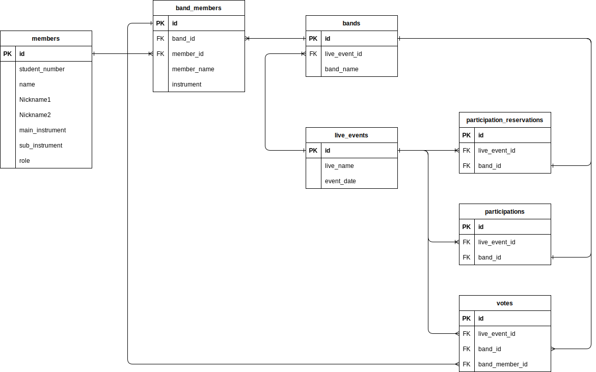

# Villagers Manager
某大学の某サークル用の管理アプリケーションである。

## 環境構築
以下に環境構築手順を示す。
### Docker

### Composer

### Sail
以下のコマンドを実行する。（[参考](https://readouble.com/laravel/9.x/ja/sail.html)）
```sh
docker run --rm \
    -u "$(id -u):$(id -g)" \
    -v "$(pwd):/var/www/html" \
    -w /var/www/html \
    laravelsail/php81-composer:latest \
    composer install --ignore-platform-reqs
```

## データベースER図
以下に本アプリケーションにおけるデータベースのER図を示す。


デーベースの各テーブルは以下のようになっている。なお、 `creat_at` などは省略してある

### 部員管理用テーブル: members
- id（non null）
- student_number（non null）
- name（non null）
- Nickname1
- Nickname2
- main_instrument
- sub_instrument
- role

### ライブ管理用テーブル: live_events
- id（non null）
- live_name
- event_date

### ライブ出演予約テーブル: participation_reservations
- id（non null）
- live_event_id（non null）
- band_id（non null）

### 出演バンドテーブル: participations
- id（non null）
- live_event_id（non null）
- band_id（non null）

### バンド情報テーブル: bands
- id（non null）
- live_event_id（non null）
- band_name（non null）

### バンドメンバー管理テーブル: band_members
- id（non null）
- band_id（non null）
- member_id（non null）
- member_name
- instrument

### 投票テーブル: votes
- id（non null）
- live_event_id（non null）
- band_id（non null）
- band_member_id（non null）


## 画面
実装すべき画面を以下に示す。

0. ログイン画面
1. メイン画面（幹部向け）
2. 部員登録form（一般部員向け）
3. 部員管理画面（幹部向け）
4. ライブイベント作成画面（幹部向け）
5. ライブ参加応募form（一般部員向け）
6. ライブ管理画面（幹部向け）
7. 投票form
8. 投票集計画面（幹部向け）

これらの画面遷移をワイヤーフレームとして以下の図に示す。
